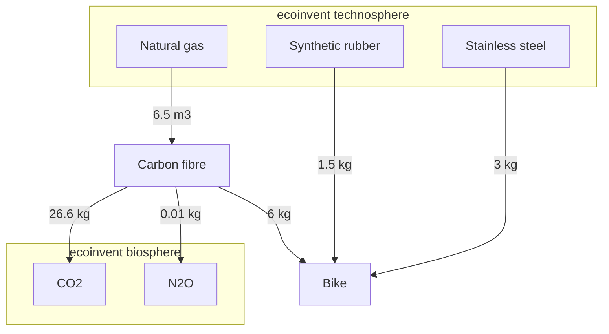

This Mermaid code in the code block below can be used to generate the flowchart. Paste, for example, into https://mermaid.live to get it visualised.

```mermaid
flowchart TD

	cf[Carbon fibre] -->|6 kg| bike[Bike]
	rubber[Synthetic rubber] -->|1.5 kg| bike
	steel[Stainless steel] -->|3 kg| bike
	
	ng[Natural gas] -->|6.5 m3| cf
	cf -->|26.6 kg| co2[CO2]
	cf -->|0.01 kg| n2o[N2O]
	
	subgraph ecoinvent technosphere
		rubber
		steel
		ng
	end
	
	subgraph ecoinvent biosphere
		co2
		n2o
	end
```